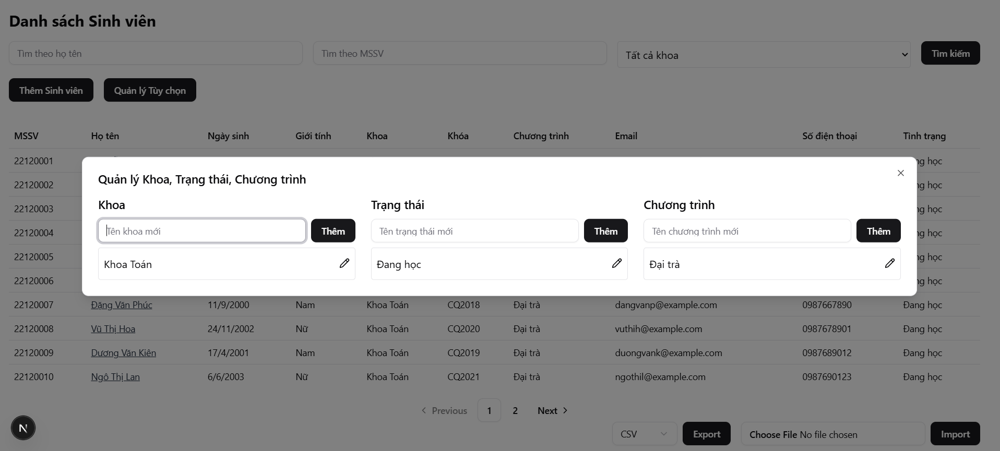
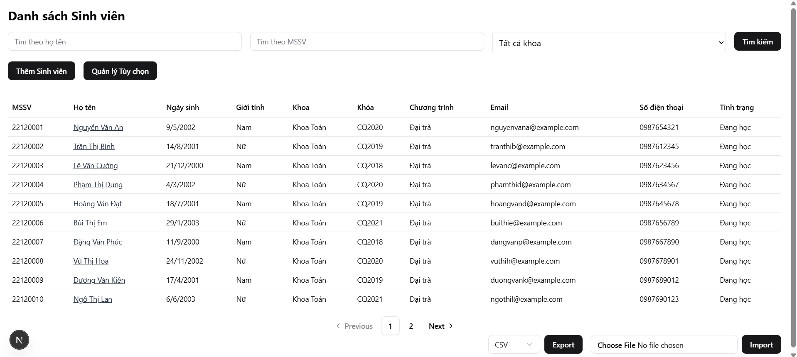
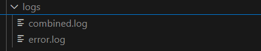
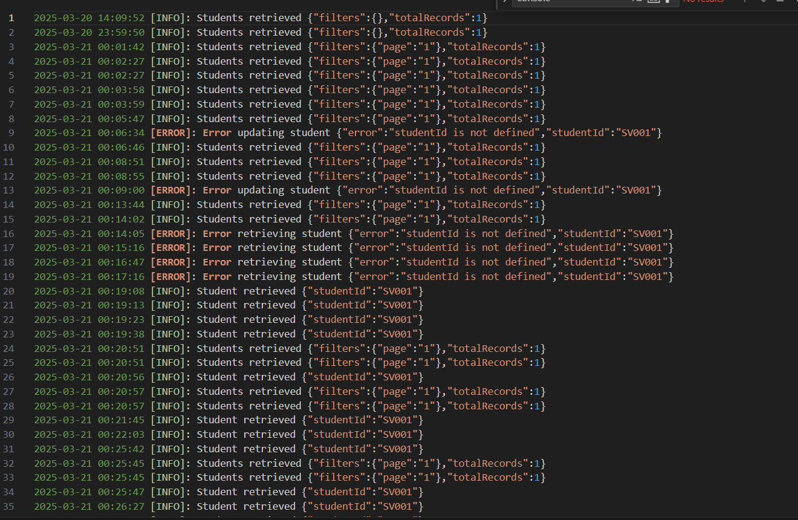

# Project Name

Student Management

## Hướng dẫn cài đặt và chạy chương trình

## Cài đặt

### Backend

1. ```
    cd backend/
   ```
2. ```
    npm install
   ```
3. Tạo file <b>.env</b> với cấu trúc như <b>.env.example</b>

   ```
    PORT=
    NODE_ENV=

    DB_NAME=
    DB_USER=
    DB_PASSWORD=
    DB_HOST=
    DB_PORT=
    DB_DIALECT=
    ALLOWED_EMAIL_DOMAIN=student.hcmus.edu.vn
   ```

- **PORT**: Cổng chạy ứng dụng Node.js
- **NODE_ENV**: `development`, `production`, hoặc `test`
- **DB_NAME**: Tên database
- **DB_USER**: Tên user database
- **DB_PASSWORD**: Mật khẩu database
- **DB_HOST**: Địa chỉ database (nếu cục bộ thì là `localhost`)
- **DB_PORT**: Cổng database (PostgreSQL thường là `5432`, MySQL là `3306`)
- **DB_DIALECT**: Loại database (`postgres`, `mysql`, `sqlite`, v.v.)
- **ALLOWED_EMAIL_DOMAIN=student.hcmus.edu.vn**: Email sinh viên chỉ được phép có tên miền này

4. Yêu cầu có Database sử dụng <b>sequelize</b> để thiết lập, ở đây nhóm dùng <b>PostgreSQL</b>. Sau đó tiến hành chạy migrate để tạo bảng
   ```
   npx sequelize-cli db:migrate
   ```
5. Tiếp đến, tiến hành điền dữ liệu seeders
   ```
   npx sequelize-cli db:seed:all
   ```

### Frontend

1.  ```
    cd frontend/
    ```
2.  ```
    npm install
    ```
3.  Tạo file <b>.env.local</b> với cấu trúc như <b>.env.example</b>
    ```
    NEXT_PUBLIC_API_URL=
    ```

- Mặc định frontend chạy <b>PORT 3001</b>, để tùy chỉnh vào file <b>package.json</b>

## Chạy chương trình

### Backend

```
npm run dev
```

### Frontend

```
npm run dev
```

# Danh mục hình ảnh minh chứng

- Cho phép đổi tên & thêm mới: khoa, tình trạng sinh viên, chương trình



- Tìm kiếm theo tên khoa, khoa + tên, hỗ trợ IMPORT/EXPORT



- Logging mechanism để troubleshooting production issue & audit purposes



